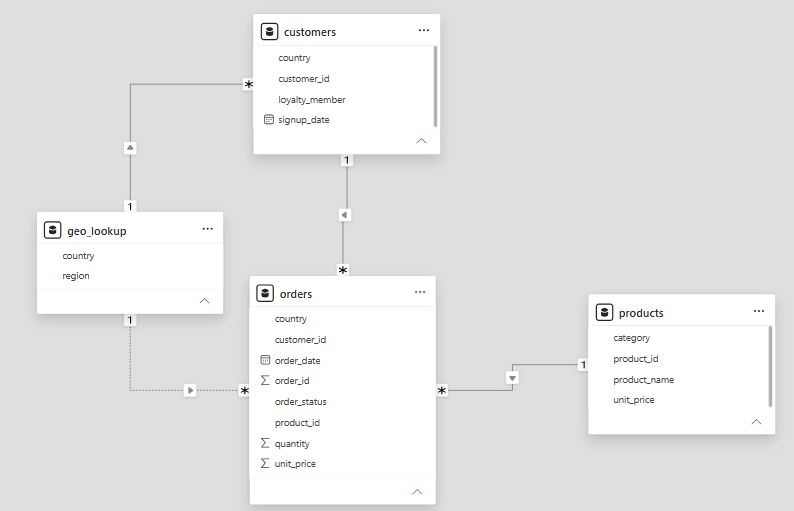
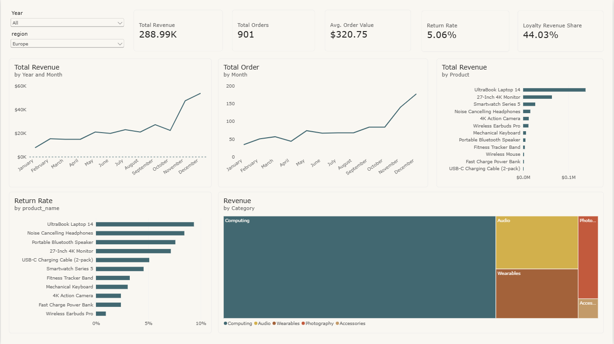

<h1 align="center">VoltEdge Electronics - E-Commerce Performance Analysis</h1>
<table align="center">
  <tr>
    <td width="1440">
      <h2 align="center">Client Background & Project Overview</h2>
      <body>
        <strong>VoltEdge Electronics</strong> is a consumer electronics e-commerce company specializing in audio, computing, wearables, photography, and accessories across 4 major global regions: North America, Europe, Asia Pacific, and Latin America.  
         
        Reporting to the Head of Sales, this comprehensive analysis evaluates sales performance from <strong>March 2022 to December 2024</strong>. The workflow moves from raw relational data through modular SQL transformations to an executive Power BI dashboard designed to streamline commercial decisions.  
         The key insights and recommendations focus on four core Northstar Metrics:
      </body>
      <h3>Northstar Metrics</h3>
      <h4>
        <ul>
          <li><strong>Sales Trend:</strong> Analyzing revenue growth trajectory, order volume, seasonality, and peak/trough periods.</li>
          <li><strong>Product Performance:</strong> Examining top revenue drivers, category mix, and item-level refund rates.</li>
          <li><strong>Regional Performance:</strong> Evaluating geographical market dominance and cross-tab category distribution.</li>
          <li><strong>Loyalty Impact:</strong> Measuring the commercial value and average order value (AOV) lift driven by loyalty program members.</li>
        </ul>
      </h4>
    </td>
  </tr>
</table>

<table align="center">
  <tr>
    

      <h1 align="center">Technical Implementation & Architecture</h1>
      <h3 align="center">From Advanced SQL Engineering to Power BI Visuals</h3>
      <td width="920" valign="top">
        <ol>
          <li>
            <strong>Tech Stack & Database Schema:</strong>
            <ul>
              <li>PostgreSQL · SQL (CTE, Window Functions, Views) · Power BI · DAX.</li>
              <li>Consists of 4 core tables (`orders`, `customers`, `geo_lookup`, `products`) structured cleanly for analytical querying.</li>
            </ul>
          </li>
          <li>
            <strong>SQL Methodology - Why CTEs?</strong>
            <ul>
              <li><strong>Modular Readability:</strong> Logic is broken down into named blocks (`WITH ... AS`) that read top-to-bottom like a clear analytical workflow, avoiding messy nested subqueries.</li>
              <li><strong>Reusability & Chaining:</strong> Blocks can be referenced multiple times and chained sequentially where subsequent steps build directly on prior outputs.</li>
            </ul>
          </li>
          <li>
            <strong>Advanced SQL & Views:</strong>
            <ul>
              <li><strong>Window Functions:</strong> Utilizes `RANK() OVER (ORDER BY total_revenue DESC)` for product rankings and `SUM(revenue) OVER ()` for regional contribution ratios in a single pass.</li>
              <li><strong>Database Views (`vw_orders_enriched`):</strong> Encapsulates multi-table joins into a permanent reusable object, ensuring logic stays at the database layer (single source of truth).</li>
            </ul>
          </li>
        </ol>
      </td>
    

  </tr>
</table>

<h2 align="center">Dataset Structure and ERD (Entity Relationship Diagram)</h2>
<body>The database structure links orders, customers, products, and geographic lookup data as outlined below.</body>

  

<table align="center">
  <tr>
    <h1 align="center">Power BI Dashboard Preview</h1>
    

      <h3>Interactive Executive Dashboard</h3>
      
    

  </tr>
</table>

<h1 align="center">Insights Deep-Dive & Dashboard Implementation</h1>
<table align="center">
  <tr>
    <h1 align="center">Sales Trend & Global Performance</h1>
    <td width="1000" valign="top">
      <ol>
        <li>
          <strong>Consistent Revenue & Order Growth:</strong>
          <ul>
            <li>Sales grew steadily from 2022 to 2024, characterized by reliable holiday shopping spikes every November and December.</li>
            <li>Order volumes closely track revenue patterns, verifying that growth is driven primarily by transaction volume and seasonal activity.</li>
          </ul>
        </li>
      </ol>
    </td>
  </tr>
</table>

<table align="center">
  <tr>
    <td width="333" valign="top">
      <h3>Product Highlights</h3>
      <ul>
        <li>UltraBook Laptops and 27 Inch 4K Monitors act as the primary revenue anchors for the business.</li>
        <li>Computing single-handedly dominates category share across global operations.</li>
      </ul>
    </td>
    <td width="333" valign="top">
      <h3>Loyalty Impact</h3>
      <ul>
        <li>Loyalty members exhibit an AOV of ~$367 compared to ~$268 for non-members a striking 37% premium.</li>
        <li>Loyalty Revenue Share captures a major portion of overall revenue, validating program expansion.</li>
      </ul>
    </td>
    <td width="333" valign="top">
      <h3>Return Rates & Regions</h3>
      <ul>
        <li>Premium items like laptops and monitors experience higher return rates (7-9%) compared to lower-priced accessories (&lt;5%).</li>
        <li>North America dominates performance, accounting for roughly 40% of total global revenue.</li>
      </ul>
    </td>
  </tr>
</table>

<table align="center">
  <h1 align="center">Regional Deep-Dive: Europe Focus</h1>
  <tr>
    <td width="900">
      
<em>Drilling down into the European market reveals distinct regional behaviors:</em>

      <ul>
        <li><strong>KPI Overview:</strong> Total Revenue reaches $288.99K across 901 orders, with an AOV of $320.75 (higher than global norms). Return rate sits at 5.06%, while Loyalty Revenue Share captures 44.03%.</li>
        <li><strong>Product & Trends:</strong> UltraBook Laptop 14 leads revenue generation. Monthly curves mirror transaction volumes with sharp holiday surges in Nov–Dec.</li>
      </ul>
    </td>
  </tr>
</table>

<table align="center">
    <h1>Recommendations</h1>
    <h4>Based on the uncovered insights, here are actionable items that VoltEdge Electronics can take away from our analysis.</h4>
      <ul>
        <h3>Sales</h3>
        <li>Remedy seasonal sales lows in early/mid-year by scaling targeted marketing campaigns and early holiday promotions.</li>
          <ul>
            <li>Capitalize on the proven Q4 holiday momentum by planning inventory ahead of November-December spikes.</li>
          </ul>
        <h3>Products</h3>
        <li>Optimize inventory and quality control for high-performing revenue anchors.</li>
          <ul>
            <li>Investigate return rates on high-AOV items like UltraBook Laptops to protect margins and customer satisfaction.</li>
            <li>Deprioritize slow-moving long-tail inventory items.</li>
          </ul>
        <h3>Loyalty Program</h3>
        <li>Expand and incentivize the loyalty program to sustain higher average order values.</li>
          <ul>
            <li>Leverage the proven 37% AOV premium of loyalty members through early access and bundle deals.</li>
          </ul>
        <h3>Regions</h3>
        <li>Strengthen market strategies across secondary regions while maintaining strong engagement in North America and Europe.</li>
      </ul>
</table>
